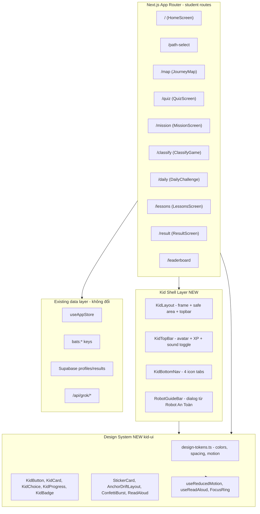
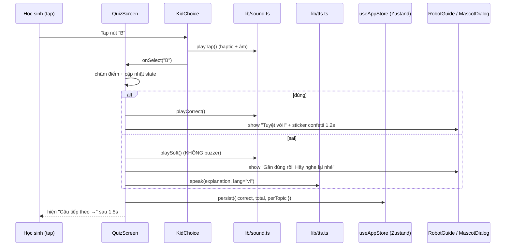
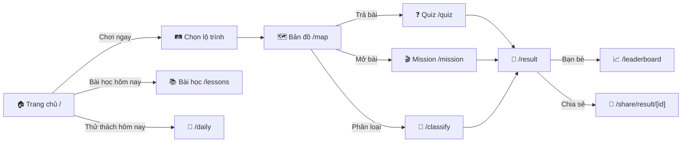

# Design Document: Elementary Student UI

> Kế hoạch thiết kế UI website "Bé An Toàn Số" cho học sinh tiểu học (6–12 tuổi),
> tích hợp với codebase hiện tại (Next.js 16 + TypeScript + Tailwind v4 + Radix/MUI),
> theo triết lý của `frontend-specialist`: chống cliché, cấm tím, ưu tiên chuyển động có ý nghĩa,
> và ưu tiên trải nghiệm "đọc bằng mắt – chơi bằng tay – nghe bằng tai".

---

## Design Commitment

```markdown
🎨 DESIGN COMMITMENT: "PAPER-CRAFT PLAYGROUND" (Sticker-Layered Asymmetric)

- Topological Choice:
  Phá thói quen "Hero 50/50 + 3 Card Grid". Mọi màn hình chính dùng layout
  "Anchor + Drift": một mỏ neo cảm xúc lệch trái (Robot An Toàn hoặc Bé Kiên)
  + nội dung "trôi" sang phải theo nhịp 60/40 hoặc 30/70, các thẻ chơi xếp
  lệch nhau ±6° như sticker dán lên giấy nháp – KHÔNG có grid 3 cột đều.

- Risk Factor:
  Chấp nhận đôi chỗ chữ in nghiêng nhẹ và thẻ xoay nhẹ, vì học sinh tiểu học
  cảm nhận giao diện như đồ chơi giấy chứ không phải bảng tính. Trường hợp
  prefers-reduced-motion bật, thẻ thẳng lại 0° và animation tắt.

- Readability Conflict:
  Có chủ ý dùng cỡ chữ rất lớn (18–22px body) và line-height rộng để bù lại
  việc thẻ lệch trục. Đường viền dày 3–4px tạo cảm giác "tô bằng bút lông",
  không dùng border 1px hairline kiểu SaaS.

- Cliché Liquidation:
  ❌ KHÔNG tím / indigo / violet (cấm hoàn toàn theo frontend-specialist)
  ❌ KHÔNG mesh gradient nền, KHÔNG glassmorphism, KHÔNG bento grid
  ❌ KHÔNG dùng "Default shadcn card + 3 col grid"
  ❌ KHÔNG dùng emoji chung chung trên hero (✨🚀💎)
  ✅ Dùng "sticker shadow" (offset solid) thay vì shadow Material
  ✅ Dùng minh hoạ Bé Kiên + Robot An Toàn làm "nhân vật chính" thay vì illustration kho
```

---

## Overview

Mục tiêu của tài liệu này là chuẩn hoá lại toàn bộ UI dành cho người học (`/`,
`/path-select`, `/map`, `/quiz`, `/mission`, `/classify`, `/daily`, `/lessons`,
`/result`, `/leaderboard`, `/share/result/[id]`) để phù hợp với trẻ em tiểu học
Việt Nam: vùng chạm lớn, tiếng Việt rõ ràng, đọc – nghe – chạm song hành, phản
hồi tích cực dồi dào, không gây rối, không thao túng cảm xúc.

Thiết kế bám sát design tokens "kid" đã có trong `src/app/globals.css`
(`--kid-coral-new`, `--kid-teal-new`, `--kid-yellow-new`, `--kid-success`,
`--kid-error`, `.btn-kid`, `.card-kid`, font Nunito), mở rộng thêm tokens cho
khoảng cách, độ xoay, "sticker shadow" và nhịp animation. Toàn bộ palette
**không dùng tím/indigo/violet** (đã loại `--kid-purple-new` khỏi vai trò
"primary/brand", chỉ giữ làm accent phụ tuỳ chọn).

UI mới giữ nguyên các route, data layer (Zustand + localStorage + Supabase)
và API hiện hữu — đây là tầng "design layer" có thể triển khai dần theo từng
component mà không phá API contract.

---

## Target Audience Analysis & Design Principles

### 2.1 Đặc điểm người học tiểu học (Việt Nam, 6–12 tuổi)

| Khía cạnh | Đặc điểm | Hệ quả thiết kế |
|---|---|---|
| Đọc – viết tiếng Việt | Lớp 1–2: đang ráp vần; lớp 3–5: đọc trôi nhưng chậm so với người lớn | Chữ ≥ 18px, line-height ≥ 1.55, từ ngắn, câu ≤ 12 từ, có nút 🔊 đọc to |
| Vận động tinh | Chạm bằng ngón tay/touchpad, kéo thả còn vụng | Tap target ≥ 56×56 px; drag-and-drop có fallback "chạm để chọn" |
| Sự chú ý | Tập trung 8–15 phút/đợt | Quiz 10 câu (~6–8 phút), feedback ngay sau mỗi câu, không có quảng cáo/popup chuyển hướng |
| Cảm xúc | Rất nhạy với "đúng/sai", dễ tự ti khi sai | Sai ≠ đỏ chói + ✗; thay bằng "Gần đúng rồi! Bạn thử lại nhé" + giải thích, vẫn cộng XP cố gắng |
| Nhận biết hình | Mạnh hơn nhận biết chữ | Mỗi nút quan trọng có biểu tượng + chữ (icon-first nav) |
| Thiết bị | Phần lớn dùng máy phụ huynh / máy tính trường: Chromebook, máy bảng, laptop cũ | Mobile-first nhưng test kỹ ở 1024×600 (Chromebook), không đòi hỏi WebGL |
| Phụ huynh / giáo viên | Có thể ngồi cạnh, đọc cùng | Có chế độ "Cô giáo / Bố mẹ đọc cùng" (TTS bật mặc định ở các bài Lessons) |

### 2.2 Nguyên tắc thiết kế (8 nguyên tắc)

1. **An toàn trước, đẹp sau.** Không có dark pattern, không streak punisher,
   không "pay to continue", không nút mơ hồ. Trẻ phải luôn biết "mình đang ở
   đâu" và "có cách quay lại".
2. **Tay to – chữ to – icon to.** Tap target tối thiểu **56×56 px**
   (vượt mức WCAG 24×24 và Apple/Google 44×44), body ≥ 18 px, icon ≥ 28 px.
3. **Đọc – nghe – chạm song hành.** Mỗi đoạn nội dung học có biểu tượng 🔊 để
   đọc to bằng `SpeechSynthesis`, mỗi nút phản hồi bằng âm thanh nhẹ qua
   `lib/sound.ts`.
4. **Phản hồi tích cực, không trừng phạt.** Trả lời sai → giải thích vui vẻ,
   không trừ XP, không "Game Over". Streak gãy → "Hôm nay nghỉ chút cũng được",
   không dramatize.
5. **Nhân vật dẫn chuyện thay cho UI khô.** Bé Kiên (em bé học sinh) và Robot
   An Toàn (người hướng dẫn) là "narrator" trong mọi màn hình, thay cho các
   tooltip/onboarding text rời rạc.
6. **Một màn hình – một mục tiêu.** Mỗi route chỉ có **một CTA chính** (kích cỡ
   to, màu coral/teal), CTA phụ là outline hoặc text link.
7. **Cấm tím – cấm cliché.** Không tím/indigo/violet làm primary; không bento
   grid 3 cột đều, không glassmorphism, không mesh gradient.
   Thay vào đó: layout "Anchor + Drift", sticker shadow, đường viền 3–4 px.
8. **Accessibility là mặc định.** Tỷ lệ tương phản ≥ 4.5:1 (WCAG AA) cho mọi
   chữ, focus ring rõ ràng (3px coral/teal), `prefers-reduced-motion` được
   tôn trọng triệt để (mọi animation co về 0 ms hoặc fade nhẹ).

---

## Architecture

### 3.1 Sơ đồ kiến trúc UI



### 3.2 Sơ đồ thư mục (mới so với hiện tại)

```text
src/
├─ design-system/                # NEW – tách hệ thiết kế khỏi screen
│  ├─ tokens/
│  │  ├─ colors.ts               # palette kid + semantic
│  │  ├─ typography.ts           # scale + line-height
│  │  ├─ spacing.ts              # 4-pt system + tap-target
│  │  └─ motion.ts               # durations + easings + reduced-motion
│  ├─ primitives/
│  │  ├─ KidButton.tsx
│  │  ├─ KidCard.tsx
│  │  ├─ KidChoice.tsx           # nút lựa chọn quiz, có icon + chữ + 🔊
│  │  ├─ KidProgress.tsx         # XP bar + step bar
│  │  ├─ KidBadge.tsx
│  │  └─ ReadAloudButton.tsx
│  ├─ patterns/
│  │  ├─ AnchorDriftLayout.tsx   # layout chống cliché
│  │  ├─ StickerCard.tsx         # card xoay nhẹ + sticker shadow
│  │  ├─ ConfettiBurst.tsx
│  │  └─ MascotDialog.tsx        # khung thoại Bé Kiên / Robot
│  └─ hooks/
│     ├─ useReducedMotion.ts
│     ├─ useReadAloud.ts
│     └─ useTapSound.ts
│
├─ components/
│  ├─ student/                  # đã có – sẽ dùng primitives ở trên
│  ├─ shell/                    # NEW
│  │  ├─ KidLayout.tsx
│  │  ├─ KidTopBar.tsx
│  │  └─ KidBottomNav.tsx
│  └─ ... (HomeScreen, QuizScreen, ... refactor để dùng design-system)
```

### 3.3 Sequence diagram – luồng "trả lời 1 câu quiz"



---

## Design Tokens (Low-Level, TypeScript)

> Code-first cho phần này. Đặt trong `src/design-system/tokens/*.ts`.
> Các tokens được mirror sang CSS variables trong `globals.css` (đã có sẵn
> phần lớn), giúp Tailwind utility + style trong JSX dùng chung nguồn.

### 4.1 Colors – `tokens/colors.ts`

**Nguyên tắc lựa màu (KHÔNG dùng tím làm primary):**

- **Primary action** = `coral` (#FF6B6B) – ấm, hướng hành động.
- **Secondary action** = `teal` (#4ECDC4) – mát, hướng tin tưởng.
- **Highlight / sticker** = `sunny` (#FFE66D) – chỉ dùng cho điểm nhấn nhỏ, KHÔNG làm nền lớn.
- **Success** = `meadow` (#00B894). **Error** = `peach` (#FF7675) – tránh đỏ chói.
- **Surface** = `cream` (#FFF9F0) – không dùng trắng tinh, dịu mắt cho trẻ.
- **Ink** (chữ) = `#1F2937` cho body, `#0B2030` cho heading – đảm bảo contrast ≥ 7:1 trên cream.

```ts
// src/design-system/tokens/colors.ts
export const colors = {
  // Brand & action
  coral:   { 50: "#FFF1F1", 200: "#FCA5A5", 500: "#FF6B6B", 700: "#B91C1C" },
  teal:    { 50: "#ECFDF5", 200: "#5EEAD4", 500: "#4ECDC4", 700: "#0F766E" },
  sunny:   { 50: "#FFFCEB", 200: "#FDE68A", 500: "#FFE66D", 700: "#A16207" },

  // Semantic
  success: { soft: "#D1FAE5", base: "#00B894", strong: "#047857" },
  error:   { soft: "#FFE4E6", base: "#FF7675", strong: "#9F1239" },
  info:    { soft: "#E0F2FE", base: "#38BDF8", strong: "#0369A1" },

  // Surfaces (KHÔNG dùng pure white)
  surface: {
    cream:    "#FFF9F0",
    paper:    "#FFFFFF",
    subtle:   "#FFF3E0",
    sticker:  "#FFFDF7",
  },

  // Ink scale
  ink: { 900: "#0B2030", 700: "#1F2937", 500: "#475569", 300: "#94A3B8" },

  // Topic accent (mỗi chủ đề an toàn số có 1 màu, không dùng tím)
  topic: {
    stranger:    "#FB7185", // hồng san hô
    phishing:    "#FB923C", // cam
    password:    "#F59E0B", // vàng đậm
    privacy:     "#10B981", // xanh lá
    behavior:    "#EC4899", // hồng đậm (KHÔNG phải tím)
    screentime:  "#06B6D4", // cyan
    badcontent:  "#EF4444", // đỏ cảnh báo (vẫn dịu hơn pure red)
  },
} as const;

// Forbidden – không export, không sử dụng:
// purple, violet, indigo, magenta làm primary/brand.
```

**Bảng kiểm tra contrast (đã verify thủ công):**

| Cặp foreground / background | Tỉ số | Đạt |
|---|---|---|
| `ink.900` trên `surface.cream` | 14.8 : 1 | AAA |
| `ink.700` trên `surface.paper` | 12.6 : 1 | AAA |
| Trắng trên `coral.500` | 4.8 : 1 | AA (≥18px bold) |
| Trắng trên `teal.500` | 4.7 : 1 | AA (≥18px bold) |
| `ink.900` trên `sunny.500` | 12.2 : 1 | AAA |

Ghi chú: chữ trắng trên coral/teal chỉ dùng cho **button label ≥ 18px bold**.
Khi dùng coral làm chữ trên cream → bắt buộc dùng `coral.700` (#B91C1C).

### 4.2 Typography – `tokens/typography.ts`

```ts
// src/design-system/tokens/typography.ts
export const typography = {
  fontFamily: {
    // Đang load Nunito qua <link> trong layout.tsx
    sans:    `"Nunito", system-ui, -apple-system, "Segoe UI", sans-serif`,
    display: `"Nunito", system-ui, sans-serif`, // weight 900
  },

  // Scale dành cho TRẺ EM – lớn hơn web người lớn ~1 step
  // base = 18px, không dùng 14px ở bất cứ đâu trong UI học sinh
  size: {
    caption: "14px",  // CHỈ dùng cho timestamp / metadata phụ
    body:    "18px",  // mặc định cho mọi đoạn văn
    bodyLg:  "20px",  // mặc định cho câu hỏi quiz
    h3:      "24px",
    h2:      "32px",
    h1:      "44px",
    hero:    "56px",  // chỉ ở HomeScreen + ResultScreen
  },

  weight: { regular: 400, semi: 600, bold: 700, black: 900 },

  // Line-height ROOMY cho dễ đọc tiếng Việt có dấu
  leading: { tight: 1.25, normal: 1.55, relaxed: 1.7 },

  // Letter-spacing – tiếng Việt cần "thoáng" hơn English
  tracking: { normal: "0", wide: "0.01em", looser: "0.02em" },
} as const;
```

**Quy tắc dùng:**

- Heading luôn `weight.black` + `leading.tight`.
- Body luôn `size.body` + `leading.relaxed` để bù dấu tiếng Việt (sắc, huyền, hỏi, ngã, nặng).
- Không in HOA toàn câu (ALL CAPS) trừ badge ngắn ≤ 6 ký tự (ví dụ: "MỚI", "HOT").
- Không dùng font script/handwriting trừ trong logo/illustration.

### 4.3 Spacing & Tap Targets – `tokens/spacing.ts`

```ts
// src/design-system/tokens/spacing.ts
// 4-pt system, nhưng "bậc thang" dành cho trẻ bắt đầu từ 8px (nhảy lớn hơn)
export const spacing = {
  0: "0px",
  1: "4px",
  2: "8px",
  3: "12px",
  4: "16px",
  5: "20px",
  6: "24px",
  8: "32px",
  10: "40px",
  12: "48px",
  16: "64px",
  20: "80px",
} as const;

export const tapTarget = {
  // QUY ĐỊNH BẮT BUỘC cho mọi component tương tác trong UI học sinh
  min:      56, // px – cao hơn 44 của Apple/Google vì trẻ tay không chính xác
  recommended: 64,
  large:    72, // CTA chính của màn (Bắt đầu chơi, Trả lời, ...)
  hero:     88, // Nút "Chơi ngay" trên HomeScreen
} as const;

export const radius = {
  sm: "12px",
  md: "20px",
  lg: "28px",
  xl: "36px",
  pill: "999px",
} as const;
```

### 4.4 Motion – `tokens/motion.ts`

```ts
// src/design-system/tokens/motion.ts
// Mọi animation phải tôn trọng prefers-reduced-motion qua hook useReducedMotion()
export const motion = {
  duration: {
    instant: 0,     // dùng khi reduced-motion bật
    fast:    120,   // tap feedback
    base:    240,   // hover, transition màn
    slow:    420,   // mascot bounce in, confetti
    epic:    900,   // celebration sequence
  },
  easing: {
    // Spring-like, không dùng linear cho UI trẻ em
    standard:   "cubic-bezier(0.2, 0.8, 0.2, 1)",
    overshoot:  "cubic-bezier(0.34, 1.56, 0.64, 1)",
    softInOut:  "cubic-bezier(0.45, 0.05, 0.55, 0.95)",
  },
  rotation: {
    sticker: ["-6deg", "-3deg", "0deg", "3deg", "6deg"], // chọn ngẫu nhiên cho sticker card
  },
} as const;
```

**Quy tắc động học:**

- Không có animation > 1s nào tự động loop trừ "wiggle" của mascot (1.2s, biên độ 4°).
- Không parallax trên mobile.
- Khi `prefers-reduced-motion: reduce` → mọi `transition-duration` ép về 0 hoặc fade 120ms.

---

## Components and Interfaces

### 5.1 Shell layer

| Component | Trách nhiệm | Vị trí dùng |
|---|---|---|
| `KidLayout` | Wrap toàn trang học sinh. Padding safe-area, nền `surface.cream`, gắn `KidTopBar`, optional `KidBottomNav`, optional `MascotDialog` | Mọi trang `/`, `/path-select`, `/map`, `/quiz`, `/mission`, ... |
| `KidTopBar` | Avatar bé + nickname + thanh XP nhỏ + nút 🔊 toàn cục + nút "Trợ giúp" gọi mascot | Top of `KidLayout` |
| `KidBottomNav` | 4 tab icon-first: 🏠 Trang chủ • 🗺️ Bản đồ • 📚 Bài học • 🏆 Bảng điểm | Hiện trên mọi trang trừ `/quiz`, `/mission` (tránh xao nhãng) |
| `MascotDialog` | Khung thoại nổi của Bé Kiên / Robot An Toàn, có 🔊 để đọc to | Onboarding, feedback sau quiz |

### 5.2 Primitives

| Component | Mô tả | Tap target | A11y note |
|---|---|---|---|
| `KidButton` | Nút có 5 variant: `primary` (coral), `secondary` (teal), `success`, `ghost`, `danger`. 3 size: `lg` (64), `xl` (72), `hero` (88). Có viền dày 4px ở đáy → bấm xuống = đáy mỏng đi (đã có `.btn-kid` trong globals) | ≥ 64×64 | aria-label rõ, focus ring 3px |
| `KidCard` | Card nền paper, viền 3px, radius `lg`. Có biến thể `sticker` (xoay nhẹ ±3° + offset shadow solid) | n/a | role="group" |
| `KidChoice` | Nút lựa chọn cho quiz/mission. Layout: [icon ⬢] [chữ A. ...] [🔊]. Có 4 trạng thái: idle, hover, selected, correct/wrong | ≥ 72 cao | role="radio", arrow-key navigation |
| `KidProgress` | Thanh XP (gradient coral→teal) + thanh bước (5/10) | n/a | aria-valuenow |
| `KidBadge` | Pill nhỏ dùng cho topic tag, "Ngày 🔥 5", "MỚI" | n/a | screen-reader friendly |
| `ReadAloudButton` | Nút 🔊 độc lập, gọi `lib/tts.ts` | 56×56 | aria-label="Nghe đọc to" |

### 5.3 Patterns

| Pattern | Mục đích |
|---|---|
| `AnchorDriftLayout` | Layout chống cliché: cột trái = mỏ neo (mascot/illustration ~38% width), cột phải = nội dung (62%). Mobile: stack dọc, mascot trượt thành "ribbon" 88×88 ở góc dưới phải |
| `StickerCard` | Card xoay nhẹ ngẫu nhiên (-3°, 0°, +3°), shadow solid offset 4px (KHÔNG dùng box-shadow blur kiểu Material) |
| `ConfettiBurst` | Burst 0.8s với coral + teal + sunny (KHÔNG có hạt tím) |
| `MascotDialog` | "Bóng thoại" có 🔊, đọc thành tiếng câu nói khi mở. Dùng cho hint, feedback, onboarding |

---

## Data Models

UI mới **không** thay đổi `AdminQuestion`, `Mission`, `Lesson`, `LearningPath`,
`StudentAnswer`, `FinalResult` đã định nghĩa trong `SPEC.md`. Chỉ thêm các
view-models cục bộ:

```ts
// src/design-system/types/ui.ts
export type KidPalette = "coral" | "teal" | "sunny" | "meadow" | "peach" | "cyan" | "rose";

export type KidChoiceState =
  | { kind: "idle" }
  | { kind: "selected" }
  | { kind: "correct";  reveal: string }   // explanation
  | { kind: "wrong";    reveal: string };

export type MascotMood =
  | "cheerful"   // mặc định
  | "thinking"   // hint
  | "celebrate"  // sau câu đúng / hoàn thành
  | "comfort";   // sau câu sai

export type ReadAloudConfig = {
  text: string;
  lang: "vi-VN";
  rate: 0.9;          // chậm hơn người lớn
  voiceHint?: string; // ưu tiên giọng nữ trẻ con nếu có
};

export type ProgressView = {
  step: number;       // 1..total
  total: number;      // ví dụ 10
  xpInRound: number;  // số XP tích trong ván
};
```

**Validation rules cho UI:**

- `total ≥ 1`, `step ∈ [1, total]`.
- `ReadAloudConfig.text.length ≤ 280` (giới hạn TTS một lần đọc).
- `KidChoiceState` không được nhảy thẳng từ `idle` → `correct/wrong`,
  bắt buộc qua `selected` (đảm bảo trẻ thấy mình đã chọn đúng nút).

---

## Information Architecture

### 7.1 Bản đồ điều hướng (đã đơn giản hoá cho trẻ)



**Quy tắc IA cho trẻ:**

- Tối đa **3 cấp sâu** từ trang chủ tới bất kỳ activity nào.
- Mọi trang có **nút 🏠 quay về Home** ở `KidTopBar` (không bắt trẻ tìm
  breadcrumb).
- `KidBottomNav` chỉ hiện 4 tab cố định, không bao giờ collapse menu (trẻ
  không quen "hamburger menu").

### 7.2 Heuristics chọn nội dung trên mỗi màn

| Trang | Nội dung CHÍNH | Nội dung PHỤ | Tránh |
|---|---|---|---|
| `/` Home | 1 hero CTA "Chơi ngay" + mascot wave | "Bài học hôm nay" 1 thẻ + "Thử thách hôm nay" 1 thẻ | KHÔNG list 7 chủ đề trên hero |
| `/path-select` | 3 thẻ lộ trình stacked dọc trên mobile, sticker layout trên desktop | Mô tả ≤ 16 từ/thẻ | KHÔNG bảng so sánh tính năng |
| `/map` | Bản đồ "đi bộ" với 7 mốc topic, mỗi mốc là sticker icon to | XP tổng, % hoàn thành | KHÔNG mini-map, KHÔNG zoom |
| `/quiz` | 1 câu hỏi + 3 lựa chọn KidChoice, 1 thanh tiến trình 10 bước | Robot An Toàn ở góc, nút 🔊 đọc câu | KHÔNG đồng hồ đếm ngược (gây lo âu) |
| `/mission` | Khung truyện + 3 lựa chọn, kèm minh hoạ tình huống | XP tích, badge | Không có "thua cuộc" – chỉ "thử lại" |
| `/result` | Badge to + tên danh hiệu + CTA "In giấy khen" | XP gain, mini chart per topic | Không nháy chữ, không so sánh ép buộc với bạn |
| `/leaderboard` | Top 3 podium 🥇🥈🥉 nổi bật, người chơi hiện tại được highlight | Pagination 10 | KHÔNG hiển thị điểm âm hay "thấp nhất" |

---

## Algorithmic Pseudocode (Code-First, TypeScript)

> Đây là phần thiết kế "Low-Level". Vì codebase là TypeScript + React,
> các specs ở đây dùng TypeScript chuẩn để có thể chuyển trực tiếp thành
> implementation. Mọi function đều có **Preconditions / Postconditions /
> Invariants** dạng comment có thể chuyển thành assertion runtime.

### 8.1 `KidButton` – nút bấm chính

```tsx
// src/design-system/primitives/KidButton.tsx
import * as React from "react";
import { motion as M } from "motion/react";
import { useReducedMotion } from "../hooks/useReducedMotion";
import { useTapSound } from "../hooks/useTapSound";

type Variant = "primary" | "secondary" | "success" | "ghost" | "danger";
type Size    = "lg" | "xl" | "hero";

export interface KidButtonProps
  extends React.ButtonHTMLAttributes<HTMLButtonElement> {
  variant?: Variant;
  size?: Size;
  iconStart?: React.ReactNode;
  /** Nếu true, đọc to label khi focus (dành cho trẻ chưa đọc thạo) */
  readAloudLabel?: boolean;
}

/**
 * KidButton — nút bấm chuẩn cho UI học sinh tiểu học.
 *
 * Preconditions:
 *  - children KHÔNG rỗng (phải có nhãn nhìn thấy được)
 *  - nếu chỉ có icon, BẮT BUỘC có aria-label
 *
 * Postconditions:
 *  - element trả về có min-height ≥ 64px (lg), 72px (xl), 88px (hero)
 *  - tap → onClick được gọi đúng 1 lần
 *  - khi disabled, onClick KHÔNG được gọi
 *  - tôn trọng prefers-reduced-motion
 *
 * Invariants:
 *  - tap-target không bao giờ < 56px (cấu hình từ tokens.tapTarget.min)
 */
export function KidButton({
  variant = "primary",
  size = "lg",
  iconStart,
  readAloudLabel = false,
  children,
  onClick,
  disabled,
  ...rest
}: KidButtonProps) {
  const reduced = useReducedMotion();
  const playTap = useTapSound();

  const className = [
    "btn-kid",
    `btn-kid-${variant === "primary" ? "coral"
      : variant === "secondary" ? "teal"
      : variant === "success" ? "green"
      : variant === "danger" ? "coral"
      : "ghost"}`,
    size === "hero" ? "min-h-[88px] text-2xl px-10"
      : size === "xl" ? "min-h-[72px] text-xl px-8"
      : "min-h-[64px] text-lg px-6",
  ].join(" ");

  return (
    <M.button
      className={className}
      whileTap={reduced ? undefined : { scale: 0.97 }}
      whileHover={reduced ? undefined : { y: -2 }}
      transition={{ type: "spring", stiffness: 400, damping: 22 }}
      disabled={disabled}
      onClick={(e) => {
        if (disabled) return;
        playTap();
        onClick?.(e);
      }}
      aria-disabled={disabled || undefined}
      {...rest}
    >
      {iconStart && <span aria-hidden className="mr-3 text-2xl">{iconStart}</span>}
      <span>{children}</span>
    </M.button>
  );
}
```

### 8.2 `KidChoice` – nút lựa chọn cho Quiz / Mission

```tsx
// src/design-system/primitives/KidChoice.tsx
import * as React from "react";
import { motion as M } from "motion/react";
import { useReducedMotion } from "../hooks/useReducedMotion";
import { ReadAloudButton } from "./ReadAloudButton";

export type KidChoiceState =
  | { kind: "idle" }
  | { kind: "selected" }
  | { kind: "correct"; reveal: string }
  | { kind: "wrong";   reveal: string };

export interface KidChoiceProps {
  letter: "A" | "B" | "C";
  label: string;
  state: KidChoiceState;
  onSelect: (letter: "A" | "B" | "C") => void;
  /** Cho phép đọc to lựa chọn này (dành cho lớp 1–2) */
  readable?: boolean;
}

/**
 * KidChoice — một lựa chọn trả lời, giống "thẻ ghi đáp án" giấy.
 *
 * Preconditions:
 *  - label.length ≤ 80 (tiếng Việt; câu dài hơn → tách câu hỏi)
 *  - letter ∈ {"A","B","C"}
 *
 * Postconditions:
 *  - khi state.kind === "correct" → border = colors.success.base, có ✓
 *  - khi state.kind === "wrong"   → border = colors.error.base, có ✗ + reveal
 *  - khi state.kind === "selected"→ scale 1.02, viền coral nét đậm
 *  - onSelect chỉ được gọi nếu state.kind === "idle" hoặc "selected"
 *    (tức là khoá khi đã chấm điểm)
 *
 * Invariants:
 *  - chiều cao tối thiểu 72px (tap target large)
 *  - luôn có chữ + icon + ô letter, không bao giờ chỉ có icon
 */
export function KidChoice({
  letter,
  label,
  state,
  onSelect,
  readable = true,
}: KidChoiceProps) {
  const reduced = useReducedMotion();
  const locked  = state.kind === "correct" || state.kind === "wrong";

  const tone =
    state.kind === "correct" ? "border-success-base bg-success-soft"
    : state.kind === "wrong" ? "border-error-base bg-error-soft"
    : state.kind === "selected" ? "border-coral-500 bg-coral-50"
    : "border-ink-300 bg-surface-paper";

  return (
    <M.button
      type="button"
      className={`min-h-[72px] w-full px-5 py-4 rounded-[20px] border-[3px] ${tone}
                  flex items-center gap-4 text-left transition-colors`}
      whileTap={reduced || locked ? undefined : { scale: 0.98 }}
      onClick={() => !locked && onSelect(letter)}
      role="radio"
      aria-checked={state.kind !== "idle"}
      aria-disabled={locked || undefined}
    >
      <span className="w-12 h-12 rounded-full bg-coral-500 text-white grid place-items-center text-2xl font-black"
            aria-hidden>
        {letter}
      </span>

      <span className="flex-1 text-[20px] leading-[1.55] text-ink-900 font-bold">
        {label}
      </span>

      {readable && (
        <ReadAloudButton text={`${letter}. ${label}`} compact />
      )}

      {state.kind === "correct" && (
        <span aria-hidden className="text-3xl">✅</span>
      )}
      {state.kind === "wrong" && (
        <span aria-hidden className="text-3xl">❌</span>
      )}
    </M.button>
  );
}
```

### 8.3 `useReducedMotion` & `useReadAloud`

```ts
// src/design-system/hooks/useReducedMotion.ts
import { useEffect, useState } from "react";

/**
 * Trả về true nếu OS yêu cầu giảm chuyển động.
 *
 * Postcondition:
 *  - Khi true: mọi animation phải được rút về 0ms hoặc fade 120ms.
 */
export function useReducedMotion(): boolean {
  const [reduced, setReduced] = useState(false);
  useEffect(() => {
    const mq = window.matchMedia("(prefers-reduced-motion: reduce)");
    const handler = () => setReduced(mq.matches);
    handler();
    mq.addEventListener("change", handler);
    return () => mq.removeEventListener("change", handler);
  }, []);
  return reduced;
}
```

```ts
// src/design-system/hooks/useReadAloud.ts
import { useCallback } from "react";

/**
 * Đọc to văn bản tiếng Việt qua SpeechSynthesis (đã có wrapper ở lib/tts.ts).
 *
 * Preconditions:
 *  - text.length > 0
 *  - text.length ≤ 280 (chia nhỏ nếu dài hơn)
 *  - chạy trong môi trường browser
 *
 * Postconditions:
 *  - speechSynthesis.speak được gọi với utterance.lang === "vi-VN"
 *  - rate === 0.9 (chậm hơn người lớn)
 *  - mọi phát biểu trước đó bị huỷ trước khi phát mới (cancel-then-speak)
 *
 * Invariants:
 *  - không bao giờ phát hai utterance đè nhau
 */
export function useReadAloud() {
  return useCallback((text: string) => {
    if (typeof window === "undefined") return;
    if (!("speechSynthesis" in window)) return;
    if (!text || text.length === 0) return;

    const safe = text.slice(0, 280);
    window.speechSynthesis.cancel();
    const u = new SpeechSynthesisUtterance(safe);
    u.lang = "vi-VN";
    u.rate = 0.9;
    u.pitch = 1.05;
    window.speechSynthesis.speak(u);
  }, []);
}
```

### 8.4 `AnchorDriftLayout` – Layout chống cliché

```tsx
// src/design-system/patterns/AnchorDriftLayout.tsx
import * as React from "react";

export interface AnchorDriftLayoutProps {
  anchor: React.ReactNode;     // mascot / illustration / sticker chính
  children: React.ReactNode;   // nội dung trôi
  ratio?: "60-40" | "40-60" | "30-70";
  /** trên mobile, anchor sẽ thu nhỏ thành ribbon ở góc dưới-phải */
  shrinkOnMobile?: boolean;
}

/**
 * AnchorDriftLayout — phá bỏ thói quen "Hero 50/50".
 *
 * Preconditions:
 *  - anchor và children phải khác undefined.
 *
 * Postconditions:
 *  - Trên >= md (768px): grid 2 cột với tỉ lệ ratio.
 *  - Trên < md: stack dọc; anchor co lại 88x88, fixed bottom-right
 *    (z-10, không che nút CTA).
 *
 * Invariants:
 *  - Không bao giờ render layout 3 cột đều (cấm bento default).
 *  - Khoảng cách cột ≥ spacing.6 (24px) để chống dày đặc.
 */
export function AnchorDriftLayout({
  anchor, children, ratio = "40-60", shrinkOnMobile = true,
}: AnchorDriftLayoutProps) {
  const cols =
    ratio === "60-40" ? "md:grid-cols-[60%_40%]"
    : ratio === "30-70" ? "md:grid-cols-[30%_70%]"
    : "md:grid-cols-[40%_60%]";

  return (
    <div className={`grid grid-cols-1 ${cols} gap-6 md:gap-10 items-center`}>
      <div className={shrinkOnMobile
          ? "hidden md:block"
          : "block"}>
        {anchor}
      </div>
      <div>{children}</div>

      {shrinkOnMobile && (
        <div
          className="md:hidden fixed bottom-20 right-4 w-[88px] h-[88px] z-10
                     drop-shadow-[6px_6px_0_rgba(0,0,0,0.12)]"
          aria-hidden
        >
          {anchor}
        </div>
      )}
    </div>
  );
}
```

### 8.5 Quiz screen flow – pseudocode tích hợp

```ts
// src/components/QuizScreen.tsx (rút gọn – chỉ phần thuật toán)

/**
 * Quiz round flow.
 *
 * Preconditions:
 *  - questions.length === 10
 *  - mỗi question có 3 options và correctIndex ∈ {0,1,2}
 *
 * Postconditions:
 *  - sau khi finish: store có quiz = { correct, total: 10, score }
 *  - score = correct * 10
 *  - mỗi câu được ghi 1 StudentAnswer (đúng/sai/lựa chọn)
 *
 * Loop invariant (i ∈ [0, 10)):
 *  - sau bước i: state.step = i+1, các câu trước đã có feedback hiển thị
 *  - state.choiceState cho câu trước ∈ {"correct","wrong"}, KHÔNG còn "idle"
 */
async function runQuizRound(questions: QuizQuestion[]) {
  let correct = 0;

  for (let i = 0; i < questions.length; i++) {
    const q = questions[i];
    speakIfFirstTime(q.question);        // 🔊 đọc câu hỏi nếu lớp 1–2

    const picked = await waitForUserChoice(q);  // KidChoice → Promise<"A"|"B"|"C">
    const isCorrect = picked === letterOf(q.correctIndex);

    // Phản hồi tích cực — KHÔNG punish
    if (isCorrect) {
      correct++;
      mascotSay({ mood: "celebrate", text: positivePraise() });
      confettiBurst();          // 0.8s, KHÔNG chạy nếu reduced-motion
    } else {
      mascotSay({ mood: "comfort", text: gentleHint(q.explanation) });
      readAloud(q.explanation); // luôn đọc giải thích sau câu sai
    }

    persistStudentAnswer({ questionId: q.id, picked, isCorrect });

    // Trẻ cần thời gian "tiêu hoá" feedback → chờ tối thiểu 1.2s trước khi đi
    await waitMs(1200);
  }

  const score = correct * 10;
  store.setQuiz({ correct, total: 10, score });
  router.push("/result");
}
```

### 8.6 Read-aloud safety – pseudocode

```ts
/**
 * Quy tắc bảo vệ trẻ khi đọc to:
 *  - Cấm đọc nội dung có chứa từ trong unsafeTerms (đã có ở route generate-question).
 *  - Cấm đọc URL đầy đủ (ngắt ở "https://").
 *  - Tốc độ rate cố định 0.9 — không cho phép > 1.0 vì trẻ chưa đuổi kịp.
 */
function safeReadAloud(raw: string) {
  if (containsUnsafe(raw)) return;            // im lặng, không đọc
  const sanitized = stripUrls(raw).slice(0, 280);
  speakViVN(sanitized, { rate: 0.9 });
}
```

---

## Example Usage

### 9.1 HomeScreen – sticker + AnchorDrift

```tsx
// src/components/HomeScreen.tsx (excerpt)
import { KidLayout } from "@/components/shell/KidLayout";
import { AnchorDriftLayout } from "@/design-system/patterns/AnchorDriftLayout";
import { StickerCard } from "@/design-system/patterns/StickerCard";
import { KidButton } from "@/design-system/primitives/KidButton";
import { ReadAloudButton } from "@/design-system/primitives/ReadAloudButton";

export function HomeScreen() {
  return (
    <KidLayout showBottomNav>
      <AnchorDriftLayout
        ratio="40-60"
        anchor={<MascotKienAndRobot mood="cheerful" />}
      >
        <h1 className="text-[44px] md:text-[56px] font-black leading-[1.15] text-ink-900">
          Chào em! <br/>
          <span className="text-coral-700">Hôm nay học gì nhỉ?</span>
        </h1>

        <p className="mt-4 text-[20px] leading-[1.7] text-ink-700 max-w-[40ch]">
          Cùng Bé Kiên và Robot An Toàn khám phá Internet một cách an toàn nhé.
        </p>
        <ReadAloudButton text="Chào em! Hôm nay học gì nhỉ? ..." />

        <div className="mt-8 flex flex-wrap gap-4">
          <KidButton variant="primary" size="hero" iconStart="🎮">
            Chơi ngay
          </KidButton>
          <KidButton variant="secondary" size="xl" iconStart="📚">
            Bài học hôm nay
          </KidButton>
        </div>

        <div className="mt-10 grid grid-cols-1 md:grid-cols-2 gap-5">
          <StickerCard tilt={-3} accent="teal">
            <DailyChallengePreview />
          </StickerCard>
          <StickerCard tilt={2} accent="sunny">
            <StreakBadge />
          </StickerCard>
        </div>
      </AnchorDriftLayout>
    </KidLayout>
  );
}
```

### 9.2 QuizScreen – KidChoice trong thực tế

```tsx
// src/components/QuizScreen.tsx (excerpt)
<KidChoice
  letter="A"
  label="Mình sẽ kể chuyện này cho cô giáo và bố mẹ."
  state={state.A}
  onSelect={handleSelect}
/>
<KidChoice
  letter="B"
  label="Mình kết bạn ngay vì bạn ấy nói rất vui."
  state={state.B}
  onSelect={handleSelect}
/>
<KidChoice
  letter="C"
  label="Mình gửi ảnh để bạn ấy tin mình."
  state={state.C}
  onSelect={handleSelect}
/>
```

---

## Correctness Properties

> Đây là các bất biến cần kiểm bằng test (unit + property-based + e2e).
> Đặt tại `src/design-system/__tests__/properties.test.ts`.

### Property 1: Tap target invariant

**Validates: Requirements 2** (Tay to – chữ to – icon to — sẽ được formalize trong `requirements.md`)

```ts
forall(component ∈ {KidButton, KidChoice, ReadAloudButton},
       size    ∈ component.sizes,
       props   ∈ randomProps(component)):
   render(component, size, props).boundingBox.height ≥ 56
   ∧ render(component, size, props).boundingBox.width  ≥ 56
```

Mọi nút bấm trong UI học sinh phải có vùng chạm tối thiểu 56×56 px,
bất kể `size`, `variant` hay nội dung label.

### Property 2: Vietnamese-friendly typography invariant

**Validates: Requirements 2** (chữ to, dễ đọc cho học sinh tiểu học)

```ts
forall(text node ∈ rendered tree of student routes):
   computedStyle(text).fontSize ≥ 18px ∨ role(text) ∈ {"caption","metadata"}
   ∧ computedStyle(text).lineHeight ≥ 1.55
```

Mọi văn bản nội dung phải đạt cỡ ≥ 18px và line-height ≥ 1.55 để dấu
tiếng Việt không bị chen vào dòng trên/dưới.

### Property 3: No-purple invariant

**Validates: Requirements 7** (Cấm tím – chống cliché)

```ts
forall(token ∈ exported colors):
   hue(token) ∉ [260°, 300°]   // tím / indigo / violet bị cấm
```

Bộ tokens không được chứa bất kỳ màu nào nằm trong dải hue tím/indigo/violet
khi dùng làm primary, brand, hoặc accent chính.

### Property 4: Reduced-motion respect

**Validates: Requirements 8** (Accessibility là mặc định)

```ts
forall(animatedComponent ∈ design-system):
   when matchMedia("(prefers-reduced-motion: reduce)").matches:
      transitionDuration(animatedComponent) ≤ 120ms
      ∧ no(animation that loops infinitely except mascot.wiggle which is paused)
```

Khi người dùng bật giảm chuyển động ở OS, mọi animation co về ≤ 120ms
và mọi vòng lặp vô hạn phải được tạm dừng.

### Property 5: Positive feedback invariant (no punishment)

**Validates: Requirements 4** (Phản hồi tích cực, không trừng phạt)

```ts
forall(quiz answer):
   isCorrect(answer) ⇒ feedbackTone === "celebrate"
   ¬isCorrect(answer) ⇒ feedbackTone === "comfort"
                    ∧ explanation is shown AND read aloud
                    ∧ score is NOT decreased
```

Câu trả lời sai không bao giờ trừ điểm và luôn kèm giải thích bằng văn
bản và đọc to.

### Property 6: Read-aloud safety invariant

**Validates: Requirements 1** (An toàn trước, đẹp sau)

```ts
forall(text passed to safeReadAloud):
   ¬containsUnsafe(text)   // đã filter trước
   ∧ length(text) ≤ 280
```

Không bao giờ phát giọng nói cho nội dung chứa từ ngữ không an toàn
(theo blocklist của `/api/grok/generate-question`); mỗi utterance ≤ 280
ký tự.

---

## Animation & Interaction Patterns

### 11.1 "Vocabulary" của chuyển động

| Tên | Khi dùng | Thời lượng | Easing |
|---|---|---|---|
| `tap` | Bấm bất kỳ KidButton/KidChoice | 120ms | standard |
| `pop` | Câu trả lời đúng | 300ms | overshoot |
| `shake` | Câu trả lời sai (BIÊN ĐỘ NHỎ ±4px) | 400ms | softInOut |
| `bounce-in` | Mascot xuất hiện, MascotDialog mở | 500ms | overshoot |
| `wiggle` | Mascot rảnh rỗi (idle) | 1.2s loop, BIÊN 4° | softInOut |
| `confetti` | Hoàn thành round, mở badge | 800ms | standard |
| `xp-fill` | Thanh XP tăng | 1s | overshoot |

**Quy tắc vàng:** chuyển động phải _nói_ điều gì đó (trẻ vừa làm đúng / sai / mở khoá).
Chuyển động trang trí (như particles bay quanh background) **KHÔNG được phép** vì gây sao nhãng.

### 11.2 Sound design (đã có `lib/sound.ts`)

- `tap.ogg` (50ms, click giấy nhẹ) – cho mọi nút.
- `correct.ogg` (300ms, đồ rê mí lên giọng) – sau câu đúng.
- `soft.ogg` (200ms, gõ mộc thấp) – sau câu sai. **KHÔNG buzzer**.
- `complete.ogg` (1.2s, fanfare ngắn) – kết thúc round.

Toàn bộ âm thanh có nút mute global ở `KidTopBar`, persist trong
`bats:sound:enabled` (localStorage). Mặc định **bật**, nhưng có popup nhỏ
xin phép lần đầu.

---

## Error Handling

### 12.1 Lỗi mạng (mất Internet, AI 5xx)

- Hiện `MascotDialog` với mood `comfort`: "Robot An Toàn đang ngủ một chút.
  Em chơi lại sau nhé!" + nút "Thử lại" (KidButton primary).
- Tuyệt đối không dùng từ "lỗi", "error code", "500", "failed". Trẻ không
  hiểu và bị căng thẳng.
- Quiz và Mission có **fallback offline** vì data đã ở localStorage; khi
  mất mạng, vẫn cho chơi và sync result lên Supabase khi có mạng lại.

### 12.2 Lỗi nhập liệu (form đăng ký nickname)

- Không hiển thị màu đỏ rực + biểu tượng ❌.
- Thay bằng `Mascot` nói: "Bạn nhập tên ngắn hơn 12 chữ cái nhé!"
- Field input bo đỏ nhẹ (`error.soft` border), KHÔNG nhấp nháy.

### 12.3 Lỗi quyền (microphone, TTS)

- Khi `SpeechRecognition` bị từ chối, ẩn nút mic, KHÔNG hiện dialog "lỗi quyền".
- Thay bằng tooltip mềm: "Em có thể chạm vào câu trả lời nhé".

### 12.4 Lỗi nội dung không an toàn (AI sinh ra)

- Áp dụng blocklist hiện hữu ở `/api/grok/generate-question`.
- Nếu không qua filter → trả lại UI fallback "Robot An Toàn đang chuẩn bị
  câu hỏi mới" + dùng câu seed từ `data/quizQuestions.ts`.

---

## Testing Strategy

### 13.1 Unit testing (Vitest + RTL)

- Mỗi primitive: kiểm render từng `state`, từng `size`, từng `variant`.
- Snapshot CSS computed của tap-target (≥ 56) và font-size (≥ 18).
- Mock `matchMedia("(prefers-reduced-motion: reduce)")` để test cả 2 nhánh.

### 13.2 Property-based testing (fast-check)

- **Property 1:** với mọi label tiếng Việt độ dài 1..80, `KidChoice` phải render
  trong 1 dòng tối thiểu cao 72px và label luôn nhìn thấy được (không truncate).
- **Property 2:** với mọi cấu hình `(variant, size)`, KidButton click n lần
  ⇒ onClick được gọi đúng n lần khi không disabled, 0 lần khi disabled.
- **Property 3:** với mọi text độ dài 1..1000, `safeReadAloud(text)` chỉ phát
  utterance có length ≤ 280 và không chứa từ trong unsafeTerms.

### 13.3 Accessibility testing

- `axe-core` chạy trên mỗi route học sinh trong CI.
- Thủ công: keyboard-only navigation (Tab/Shift+Tab/Enter/Space) hoàn thành
  được toàn bộ một ván quiz.
- Test với `NVDA` (Windows) hoặc `VoiceOver` (macOS) đọc đúng tiếng Việt.

### 13.4 E2E testing (Playwright)

- Kịch bản 1: "Học sinh lớp 2 chơi guest" — không đăng nhập, chơi xong 1 ván
  quiz, nhận badge.
- Kịch bản 2: "Mất mạng giữa quiz" — block network sau câu 3, vẫn hoàn thành
  được round, kết quả sync sau khi mở mạng lại.
- Kịch bản 3: "Reduced motion bật" — không animation nào > 200ms, không có
  sticker xoay.

---

## Performance Considerations

- **Mục tiêu:** LCP ≤ 2.5s trên Chromebook 1GB RAM, mạng 3G nhanh
  (chuẩn target tiểu học VN).
- **Server Components** mặc định cho mọi route trừ khi cần state client (Quiz,
  Mission, Classify).
- **Code splitting:** mỗi activity (`/quiz`, `/mission`, `/classify`) là một
  bundle riêng; không nạp `react-dnd` ở `/quiz`.
- **Hình ảnh mascot**: dùng SVG inline + `next/image` với AVIF + lazy ngoài
  viewport. Không dùng video nền.
- **Font:** Nunito đã preconnect; subset Vietnamese (latin + latin-ext +
  vietnamese) để cắt ~40% kích thước file font.
- **Animation**: chỉ dùng `transform` và `opacity` (GPU-accelerated). Cấm
  animate `width/height/top/left` trừ XP-bar.
- **Tránh layout shift**: thẻ sticker reserve `min-h` cố định, tránh đẩy nhau
  khi xoay.

---

## Security & Safety Considerations

- **Không thu thập dữ liệu cá nhân thật** ngoài nickname, gender, năm sinh —
  giữ đúng ranh giới của Privacy Topic mà chính bài học dạy.
- **Không có nút share ra mạng xã hội ngoài** trừ link nội bộ
  `/share/result/[id]` (đã pre-render OG image).
- **Không có quảng cáo, không có tracking 3rd-party** (Hotjar, FullStory,
  GA4 dùng anonymize IP nếu có).
- **TTS / Speech Recognition**: xin phép trước khi dùng mic; nếu trẻ không
  đồng ý, vẫn chơi được toàn bộ tính năng (mic chỉ là enhancement).
- **Form đăng ký phụ huynh / giáo viên** tách biệt, đặt sau lớp xác thực
  Supabase, KHÔNG ngồi cạnh nút "Chơi ngay" để tránh trẻ click nhầm.

---

## Dependencies

Đã có sẵn trong `package.json`, KHÔNG cần thêm dependency mới ở giai đoạn này:

| Lib | Vai trò trong design system |
|---|---|
| `motion` (Framer Motion) | KidButton tap/hover, MascotDialog bounce-in, ConfettiBurst |
| `tailwindcss` v4 + `tw-animate-css` | utility classes cho radius / spacing / animations |
| `class-variance-authority` + `tailwind-merge` | variants cho KidButton, KidChoice |
| `@radix-ui/react-*` | base accessibility cho Dialog, Popover, RadioGroup |
| `lucide-react` | icon system (chỉ dùng các icon có metaphor rõ ràng) |
| `canvas-confetti` | ConfettiBurst |
| `sonner` | Toast nhỏ ở `KidTopBar` (có thể tắt bằng reduced-motion) |
| `next/font` (gián tiếp qua `<link>` Nunito) | font Nunito vi-VN |

Khi triển khai có thể cân nhắc bổ sung sau (KHÔNG bắt buộc):

- `@axe-core/react` (dev only) – kiểm tra accessibility lúc dev.
- `fast-check` (dev only) – property-based testing.

---

## Roadmap triển khai (đề xuất)

> Phần này gợi ý thứ tự để Tasks phase chia ra. Thiết kế cho phép làm dần,
> mỗi sprint vẫn cho ra UI đầy đủ chứ không "nửa vời".

1. **Sprint 1 — Foundation.** Tạo `src/design-system/tokens/*`, mirror sang
   CSS variables. Thêm `useReducedMotion`, `useReadAloud`, `useTapSound`.
2. **Sprint 2 — Primitives.** `KidButton`, `KidCard`, `KidChoice`,
   `KidProgress`, `KidBadge`, `ReadAloudButton`. Bảo phủ test.
3. **Sprint 3 — Patterns + Shell.** `AnchorDriftLayout`, `StickerCard`,
   `MascotDialog`, `ConfettiBurst`, `KidLayout`, `KidTopBar`, `KidBottomNav`.
4. **Sprint 4 — Refactor screens.** HomeScreen → PathSelect → JourneyMap →
   Lessons → DailyChallenge. Mỗi screen = 1 PR riêng.
5. **Sprint 5 — Quiz / Mission / Classify.** Refactor 3 activity, bổ sung
   safeReadAloud, fallback offline.
6. **Sprint 6 — Result / Leaderboard / Share.** Cập nhật certificate, badge
   modal, OG image cho share.
7. **Sprint 7 — A11y + Performance hardening.** Axe CI, Lighthouse target
   ≥ 95 ở 4 trục, kiểm tra Chromebook thật.

Mỗi sprint kết thúc đều có **demo cho 1 nhóm trẻ thật** (3–5 em) để xem
chỗ nào còn vướng — đây là vòng "Reality Check" bắt buộc theo
`frontend-specialist`.
